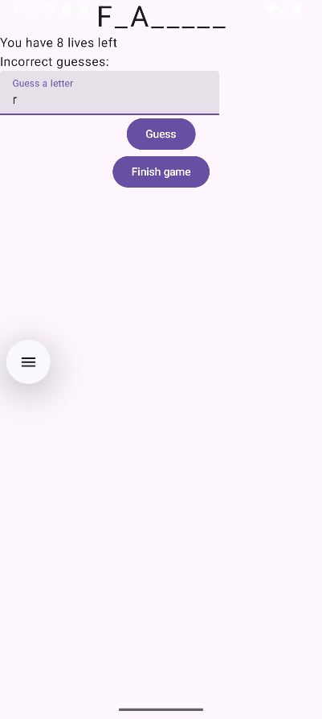
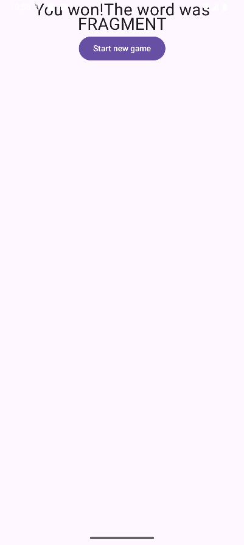

# Guessing Game (Compose Edition)
Учебное приложение-игра "Угадай число", полностью переписанное с использованием современного UI-тулкита Jetpack Compose. Проект демонстрирует миграцию с традиционного XML-подхода на декларативный.

# Описание
Пользователь вводит число, пытаясь угадать загаданное приложением. Реализованы те же функции, что и в View-версии: отслеживание попыток, переход на экран результата и запуск новой игры. UI построен исключительно композе-функциями.

# Стек технологий
- Язык: Kotlin
- UI: Jetpack Compose
- Архитектура: MVVM (для демонстрации интеграции с ViewModel)
- Управление состоянием: mutableStateOf(), remember
- Навигация: Navigation Component с Compose (NavHost внутри ComposeView)
- Интеграция: Использование `ComposeView` в активити/фрагменте (если применимо)

# Ключевые навыки, демонстрируемые в проекте:
- Основы Jetpack Compose: Создание Composable-функций.
- Декларативный подход: Построение UI как описание состояния, а не последовательность команд.
- Управление состоянием: Использование mutableStateOf и remember для обновления интерфейса.
- Работа с вводом данных: Использование компонента TextField в Compose.
- Обработка событий: Реагирование на клики (onClick) и другие действия пользователя.
- Интеграция с ViewModel: Использование viewModel() для разделения логики и UI.

# Особенности реализации
Этот проект является адаптацией оригинальной View-версии игры, что позволило на практике сравнить два подхода к разработке под Android:
- Императивный (View + XML) vs. Декларативный (Compose).
- Работа с состоянием через LiveData/Data Binding vs. mutableState.

# Скриншоты

  
  

